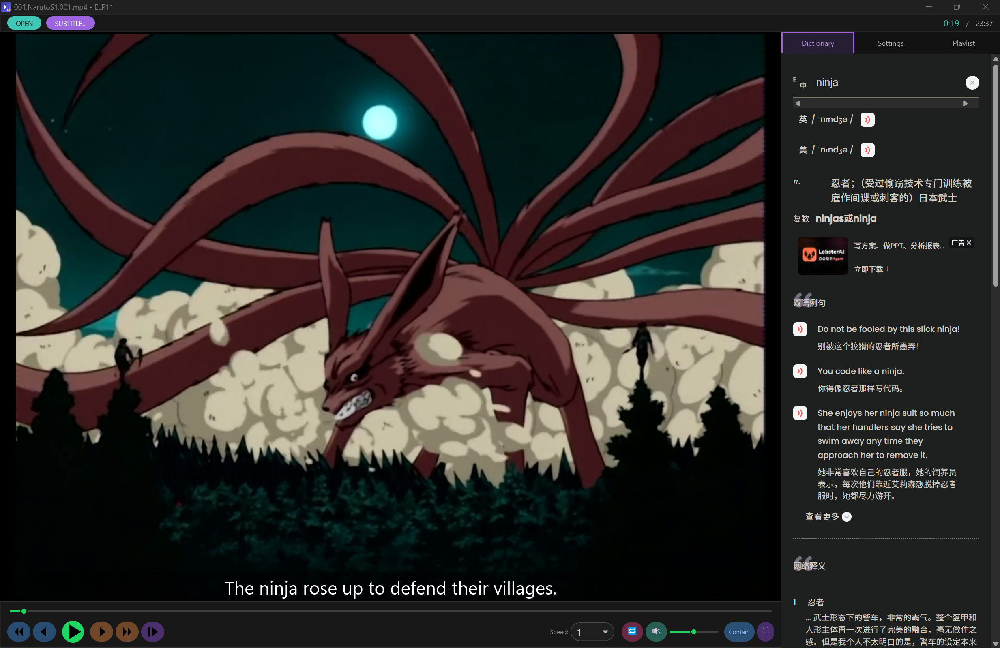

[English](./README.md) | [中文](./README.zh-CN.md)

# ELP11

一款功能丰富、以键盘操作为核心的桌面视频播放器，基于 [Iced](https://iced.rs/) 与 [GStreamer](https://gstreamer.freedesktop.org/) 构建。项目同时包含一个可复用的 GPU 加速视频控件库（`iced_video_player`）和一个桌面应用程序，后者在库的基础上集成了字幕支持、内嵌词典、播放列表与持久化设置等功能。



## 功能特性

### 播放
- 支持播放**任何 GStreamer `playbin` 支持的格式**——包括本地文件与网络流。
- 通过自定义 wgpu 管线进行 GPU 渲染：帧被解码为 NV12 格式，并在 GPU 上用 WGSL BT.709 YUV→RGB 着色器转换为 RGB。
- 自动音视频同步（将延迟的滑动平均值作为偏移量应用到管道上）。
- 逐帧步进（前进/后退）、变速播放（0.25×–4×）、音量、静音与循环播放。
- `ContentFit` 模式（Contain / Cover / Fill / None / ScaleDown），可单键循环切换。
- 全屏切换。
- 可在任意时间点截取缩略图（使用 CPU 端 YUV→RGBA 转换以生成图像句柄）。

### 字幕
- **自动发现**视频同目录下的外挂字幕（`.srt`、`.ass`、`.ssa`、`.vtt`、`.sub`、`.smi`），优先选择无语言后缀 / 英文版本。
- **手动加载**，通过文件对话框选择。
- **内嵌字幕提取**：
  - 文本字幕流（SRT/ASS/VTT）使用 `ffmpeg` 直接转换。
  - PGS（蓝光）位图字幕由内置的纯 Rust PGS 解码器解码，并使用 `Windows.Media.Ocr`（Windows 10+）进行 OCR 识别为 SRT，为提升准确率会进行 3 倍放大。生成的 `.srt` 会缓存到视频旁边。
- 文本字幕会进行清理（去除 HTML 标签、解析实体），并且每个单词都**可点击查询词典**。
- `Home` / `End` 键在字幕条目之间跳转；快速双击 `Home` 可再往前跳一条。

### 词典
- 点击任意字幕单词会打开一个**有道词典**面板，以原生 WebView（`wry`）形式覆盖在侧边栏上。页面只加载一次，后续查询通过注入 JavaScript 完成——无需重新加载——因此查词几乎是即时的。
- 移动端 User Agent 与注入的暗色模式样式表（通过 `darkreader.js`）让内嵌页面保持可读且与应用主题一致。
- （同时附带一条 API 回退路径——MyMemory 用于中文翻译，dictionaryapi.dev 用于英文释义。）

### 播放列表
- 将文件或文件夹拖放到窗口即可构建播放列表。
- 打开单个视频时会自动把同目录下的其他视频加入播放列表。
- `PageUp` / `PageDown`（或界面控件）可切换到上一项 / 下一项。

### 设置与续播
- 设置以 JSON 形式持久化：
  - Windows：`%APPDATA%\ELP11\settings.json`
  - Linux/macOS：`$HOME/.config/ELP11/settings.json`
- 可配置字幕字号（12–48 px）、历史记录开关以及最大最近文件数。
- **崩溃容错续播**：播放位置每隔几秒自动保存一次，并在关闭时保存，因此即使崩溃也不会丢失超过几秒的进度。重新打开文件时会跳回上次离开的位置（若位置距结尾不足 10 秒则从头播放）。
- 设置采用原子写入（临时文件 + 重命名），可抵御写入过程中的崩溃。
- 最近打开的文件会被记录，可在“设置”标签页中重新打开。

## 键盘快捷键

| 按键 | 功能 |
|------|------|
| 空格 / K | 切换暂停 |
| ← / → | 跳转 ±5 秒 |
| Ctrl+← / Ctrl+→ | 跳转 ±1 秒 |
| Shift+← / Shift+→ | 跳转 ±30 秒 |
| ↑ / ↓ | 音量 ±5% |
| Ctrl+↑ / Ctrl+↓（或 `[` / `]`） | 速度 ±0.25×（0.25×–4×） |
| M | 切换静音 |
| F / F11 / Enter | 切换全屏 |
| Esc | 退出全屏 / 关闭词典 |
| R | 重新播放 |
| L | 切换循环 |
| O | 打开文件对话框 |
| S | 打开字幕文件对话框 |
| C | 循环切换 ContentFit |
| ,（逗号）/ .（句号） | 逐帧后退 / 前进 |
| Home / End | 跳到上一条 / 下一条字幕 |
| PageUp / PageDown | 播放列表上一项 / 下一项 |

## 用法

### 运行应用

```bash
cargo run --release
```

使用 `O` 键、拖放文件，或在命令行传入路径（及可选字幕）来打开文件：

```bash
cargo run --release -- "C:/path/to/video.mp4" "C:/path/to/subtitle.srt"
```

### 使用库

`iced_video_player` 库对外提供 `Video` 媒体句柄与 `VideoPlayer` Iced 控件：

```rust
use iced_video_player::{Video, VideoPlayer};

fn main() -> iced::Result {
    iced::run(App::update, App::view)
}

struct App {
    video: Video,
}

impl Default for App {
    fn default() -> Self {
        App {
            video: Video::new(&url::Url::parse("file:///C:/my_video.mp4").unwrap()).unwrap(),
        }
    }
}

impl App {
    fn update(&mut self, _message: Message) {}
    fn view(&self) -> iced::Element<Message> {
        VideoPlayer::new(&self.video).into()
    }
}
```

`Video` 提供丰富的程序化控制——`set_paused`、`seek`、`set_speed`、`set_volume`、`set_muted`、`set_looping`、`restart_stream`、`step_one_frame`、`set_subtitle_url`、`set_subtitle_track`、`thumbnails`，以及位置、时长、尺寸与帧率的访问器。多个 `VideoPlayer` 实例可在同一应用中并发渲染（每个视频拥有独立的 wgpu 资源，最多支持 256 个实例）。

## 构建

GStreamer 必须作为系统依赖安装。请遵循 [gstreamer-rs 安装说明](https://github.com/sdroege/gstreamer-rs#installation)。

- **Linux**：使用系统包管理器，或通过 `nix develop` 进入 Nix 开发 shell（该 flake 针对 `x86_64-linux`，并打包了所需的 GStreamer 插件与 Vulkan）。
- **Windows（MSVC/MinGW）**与 **macOS**：遵循 gstreamer-rs 指南。
- 内嵌 PGS 字幕 OCR 与有道词典 WebView 需要 **Windows 10+**；在其他平台上这些功能会被编译关闭（平台相关代码以 `#[cfg]` 守卫）。
- 内嵌字幕提取需要在 `PATH` 中存在 `ffmpeg`。

```bash
cargo build            # 调试构建
cargo build --release  # 优化构建
cargo check            # 仅类型检查，不生成二进制
```

## 架构

```
┌──────────────────────────────────────────────────────┐
│                    ELP11 Application                   │
│  ┌──────────┐  ┌───────────┐  ┌────────────────────┐  │
│  │  Video   │  │VideoPlayer │  │  Sidebar          │  │
│  │ (handle) │  │ (widget)   │  │  Dict / Subs /    │  │
│  │          │  │            │  │  Playlist / Set.  │  │
│  └────┬─────┘  └─────┬──────┘  └────────────────────┘  │
└───────┼──────────────┼────────────────────────────────┘
        │              │  VideoPrimitive (custom wgpu primitive)
        │              ▼
        │    ┌──────────────────┐
        │    │   VideoPipeline   │  per-video wgpu resources
        │    │  (iced_wgpu)     │  (Y as R8Unorm, UV as Rg8Unorm)
        │    │ ┌──────────────┐ │
        │    │ │ WGSL Shader  │ │  BT.709 YUV→RGB on GPU
        │    │ └──────────────┘ │
        │    └──────────────────┘
        ▼
   ┌─────────────────────────┐
   │   GStreamer Pipeline     │  playbin
   │  ├── video → appsink    │──► Worker Thread ──► Frame Buffer
   │  └── text  → appsink    │──► Subtitle Buffer
   └─────────────────────────┘
```

`Video` 句柄构造一个 `playbin` 管道，强制将输出转为 NV12 并送入 `appsink`。一个后台工作线程在 `Video` 的整个生命周期内持续拉取采样，并写入共享帧缓冲；一个原子标志用于通知渲染路径有新数据到达。`VideoPlayer` 控件每帧提交一个 `VideoPrimitive`；`VideoPipeline`（实现了 `iced_wgpu` 的 primitive pipeline trait）会按需为每个视频创建纹理，遵循 GStreamer `VideoMeta` 的步长（stride）上传 Y/UV 平面，并用 YUV→RGB 着色器渲染一个纹理四边形。

一个纯 Rust 的 PGS 解码器（`pgs` 模块）负责蓝光位图字幕的 RLE 解压、调色板解析与 YUV→RGBA 转换，同时支持 13 字节 `.sup` 段头与 3 字节原始段头。

## 许可证

依据以下任一许可证授权：

- [Apache 2.0](https://www.apache.org/licenses/LICENSE-2.0)
- [MIT](http://opensource.org/licenses/MIT)

由你选择。
